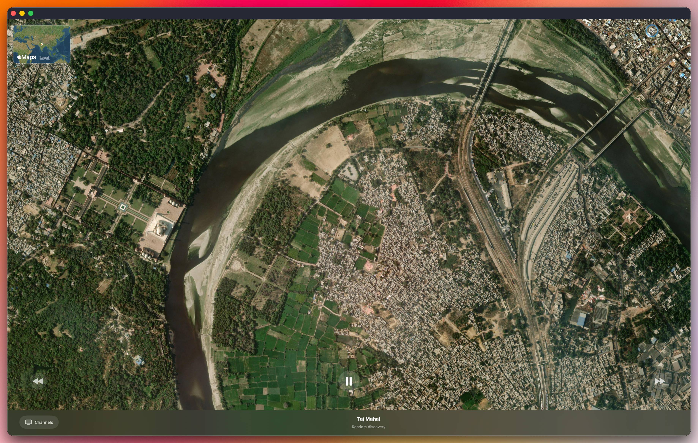

# Earth Drift



Earth Drift turns your desktop into a slow-moving geographic artwork. Unlike traditional map applications, the goal is not navigation — the app continuously glides across real satellite imagery following curated journeys: major rivers, historic railways, ancient trade routes, flight paths, and coastlines.

Choose a channel and simply watch the world pass beneath you, like looking out an airplane window.

## Requirements

- macOS 15+
- Swift 6
- Xcode (for the toolchain; no GUI needed)

## Build & Run

```sh
make          # debug build
make run      # build, package into .app, and launch
make logs     # tail live application logs
make clean    # remove build artifacts
```

All commands use Swift Package Manager via the command line. No Xcode GUI required.

Logs are written to `~/Library/Logs/EarthDrift/`.

## License

This project is licensed under the [MIT License](LICENSE).
